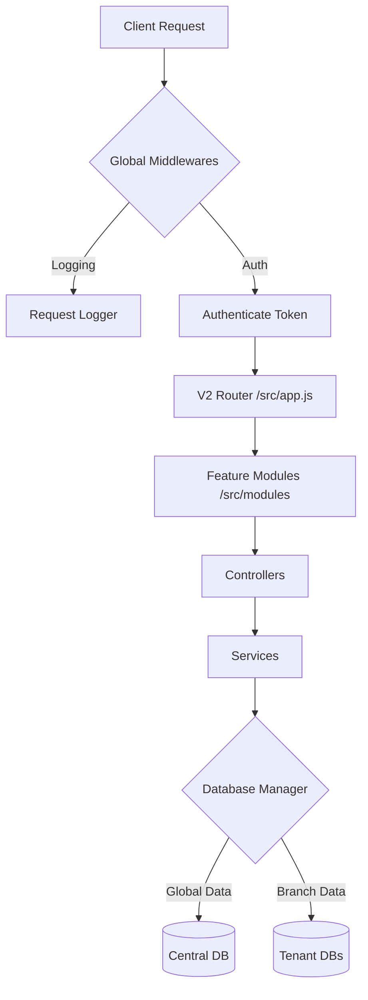

# SmartDokon Backend (Modular Monolith)

Ushbu backend tizimi **Feature-based Modular Monolith** arxitekturasiga asoslangan bo'lib, yuqori darajadagi masshtablashuvchanlik va har bir filial uchun alohida ma'lumotlar bazasini (Multi-tenancy) qo'llab-quvvatlaydi.

## 🏗 Arxitektura sxemasi

Tizim so'rovlarni quyidagi zanjir bo'yicha qayta ishlaydi:
`Request` -> `Global Middlewares (Auth, Log, Sanitize)` -> `Module Router` -> `Controller` -> `Service` -> `Model (Central/Tenant)`



## 📁 Loyiha strukturasi

```text
server/
├── index.js                # Kirish nuqtasi, Express va DB ulanishi
├── src/
│   ├── app.js              # Barcha modullarni birlashtiruvchi router
│   ├── modules/            # Biznes mantiq modullari (Har biri mustaqil)
│   │   ├── auth/           # Login, profil, xavfsizlik
│   │   ├── branches/       # Filiallar va DB yaratish mantiqi
│   │   ├── products/       # Ombor qoldig'i va mahsulotlar
│   │   ├── payments/       # POS savdo va tranzaksiyalar
│   │   └── system/         # Dashboard va umumiy sozlamalar
│   ├── shared/             # Modullararo umumiy resurslar
│   │   ├── database/       # Mongoose modellari (Central/Tenant)
│   │   ├── middlewares/    # Xavfsizlik va Logging middleware-lari
│   │   ├── helpers/        # Dinamik ulanishlar (ModelFactory)
│   │   ├── ai/             # Smart Avtopilot (AI tahlil)
│   │   └── utils/          # Logger va boshqa yordamchilar
│   ├── core/               # Tizim yadrosi
│   │   ├── cronJobs.js     # Avtomatik vazifalar (Backup, Log Pruning)
│   │   └── seeding/        # Birlamchi ma'lumotlar
│   └── bot/                # Telegram bot mantiqi (Admin/Client botlari)
├── logs/                   # Avtomatik yaratiladigan log fayllari
└── uploads/                # Media fayllar saqlanadigan joy
```

## 🗄 Ma'lumotlar bazasi mantiqi

Tizim **Hybrid Multi-tenant** modelidan foydalanadi:
- **Central DB:** `sellers`, `branches`, `global_settings` kabi butun tizim uchun umumiy ma'lumotlarni saqlaydi.
- **Tenant DB:** Har bir filial (filial_1, filial_2...) uchun alohida baza yaratiladi. Bu bazalarda `payments`, `stocks`, `costs` kabi maxfiy va katta hajmli ma'lumotlar saqlanadi.
- **Dinamik ulanish:** `modelFactory.js` orqali so'rov kelgan filialning bazasiga dinamik ravishda ulaniladi.

## 📝 Logging Tizimi

Tizimda barcha jarayonlarni kuzatish uchun maxsus logging tizimi mavjud:
- **Turlari:** 
  - `access.log`: Barcha API so'rovlar tarixi.
  - `error.log`: Tizimdagi xatoliklar va stack trace-lar.
  - `auth.log`: Kirish-chiqish va xavfsizlik hodisalari.
- **Avto-tozalash:** Cron vazifasi har kuni soat 00:00 da ishga tushib, 30 kundan eski loglarni o'chirib tashlaydi.

## 🚀 Ishga tushirish

1. **O'rnatish:**
   ```bash
   npm install
   ```
2. **Muhitni sozlash:** `.env.example` dan nusxa olib `.env` yarating.
3. **Baza yaratish va Seeding:**
   ```bash
   npm run seed
   ```
4. **Development rejimida ishga tushirish:**
   ```bash
   npm run dev
   ```

## 🛠 Ma'muriy buyruqlar

- `npm run seed`: Birlamchi admin va tizim modellarini yaratish.
- `npm run backup:run`: Barcha bazalarni zaxira nusxasini olish.
- `npm run dev`: Nodemon orqali avtomatik qayta ishga tushadigan rejim.
"# smartdokon-v41-test" 
